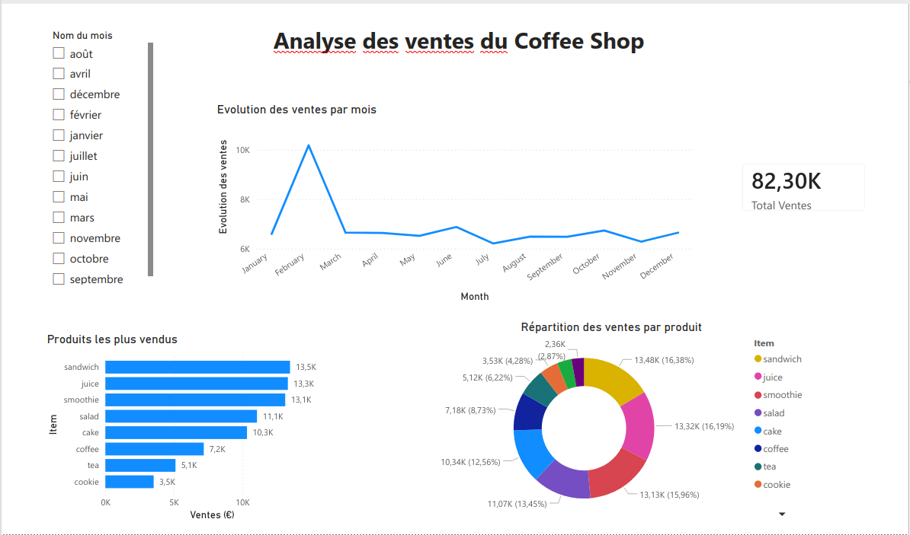

# ☕ Tableau de bord des ventes du Coffee Shop (Power BI)

Ce projet présente un **tableau de bord interactif Power BI** construit à partir d’un jeu de données de ventes d’un coffee shop.

Le dashboard permet d’analyser **les performances des ventes, les produits les plus populaires et les tendances mensuelles** afin de mieux comprendre l’activité du café.

---

## 📊 Aperçu du dashboard



---

## 📁 Jeu de données

Le jeu de données contient **9 741 transactions**, incluant :

- ID de transaction
- Produit acheté
- Quantité
- Prix unitaire
- Montant total dépensé
- Date de transaction

Ces données permettent d’effectuer des analyses sur les **tendances de vente et les performances des produits**.

---

## 📈 Insights principaux

Le tableau de bord met en évidence plusieurs informations importantes :

### 📅 Évolution des ventes
- Le mois de **février présente le pic de ventes**.
- Les ventes restent **globalement stables sur le reste de l’année**, avec de légères variations.

### 🥪 Produits les plus vendus
Les produits générant le plus de revenus sont :

1. **Sandwich**
2. **Juice**
3. **Smoothie**

Ces produits représentent une part importante du chiffre d’affaires.

### 🍩 Répartition des ventes
- Les **boissons et snacks rapides** dominent les ventes.
- Les produits comme **tea et cookie** génèrent moins de revenus.

---

## 🛠 Outils utilisés

- Power BI  
- DAX  
- Nettoyage des données  
- Data Visualization  

---

## 📂 Structure du projet

```
coffee-sales-dashboard/
│
├── data/
│   └── Coffee_Sales_Dataset.csv
│
├── dashboard/
│   └── Coffee_Sales_Analysis.pbix
│
├── images/
│   └── dashboard_preview.png
│
└── README.md
```

---

## 🚀 Utilisation

1. Télécharger le dataset  
2. Ouvrir le fichier `.pbix` dans **Power BI Desktop**  
3. Actualiser les données si nécessaire  

---

## 📌 Auteur

**Fouad MOUTAIROU**